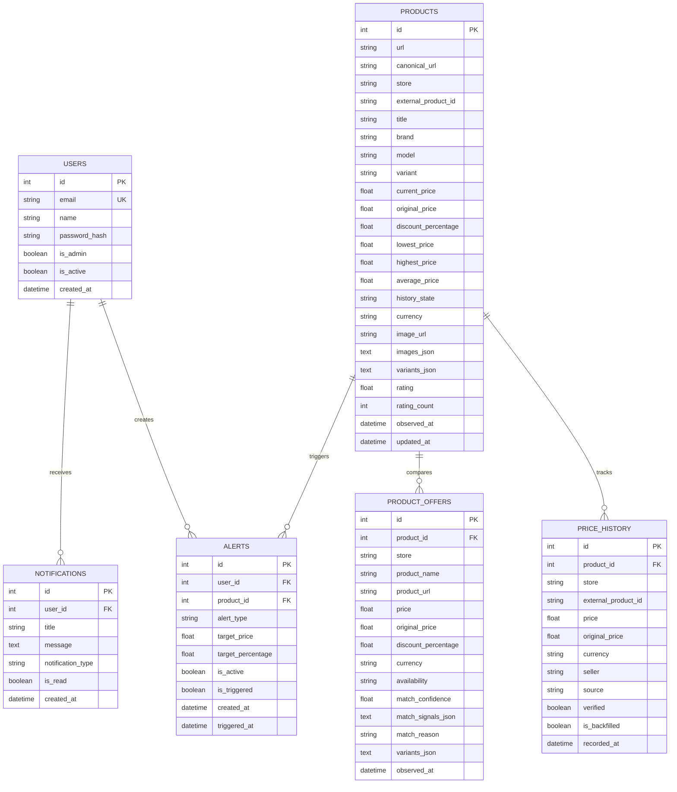

# 📊 PricePing Data Architecture & Historical Price Intelligence (`DATA.md`)

> **Comprehensive guide to PricePing's database models, historical price ingestion engines, deal scoring mathematics, and storage architecture across AWS PostgreSQL & Local SQLite.**

---

## 📑 Table of Contents

1. [🏗️ High-Level Data Architecture](#️-high-level-data-architecture)
2. [🗄️ Database Schemas & Entity Relationship (ERD)](#️-database-schemas--entity-relationship-erd)
3. [📈 2-Year Historical Price Ingestion Pipeline](#-2-year-historical-price-ingestion-pipeline)
4. [📥 Data Sources & Ingestion Providers](#-data-sources--ingestion-providers)
5. [🧮 Mathematical Invariants & Deal Score Mathematics](#-mathematical-invariants--deal-score-mathematics)
6. [🛡️ Cold-Start Handling & Data State Machine](#️-cold-start-handling--data-state-machine)
7. [⚙️ Dual-Dialect Support: AWS PostgreSQL vs Local SQLite](#️-dual-dialect-support-aws-postgresql-vs-local-sqlite)
8. [🔄 Backup, Optimization & Migration Procedures](#-backup-optimization--migration-procedures)

---

## 🏗️ High-Level Data Architecture

PricePing is built on an **audit-grade, zero-synthetic-data philosophy**. Every price point, variant tier, and historical marker originates from verifiable e-commerce observations.

```mermaid
flowchart TD
    subgraph Ingestion["Data Ingestion Layer"]
        A1[User Adds Product URL] --> B[Celery Task: ingest_product_pipeline]
        A2[Periodic Celery Beat: Every 30m / 6h] --> B
        B --> C{Historical Aggregator Service}
        C -->|Public Multi-Store Aggregator| D1[2-Year Highcharts Time-Series]
        C -->|Keepa API Amazon Domain 10| D2[Deep Amazon Historical Curves]
        C -->|Real-Time Scraper Pool| D3[Live Observation Engine]
    end

    subgraph Processing["Sanitization & Downsampling"]
        D1 --> E[Anti-False Price Filter]
        D2 --> E
        D3 --> E
        E --> F[Daily Minimum Downsampler]
    end

    subgraph Storage["Persistence & Pre-Aggregation"]
        F --> G[(PostgreSQL / SQLite)]
        G --> H[Recalculate Analytical Metrics]
        H --> I[Deal Score Algorithm: BUY NOW / WATCH / WAIT]
        H --> J[History State: AGGREGATED_2YR vs COLD_START]
    end

    subgraph Consumers["API & Frontend Delivery"]
        I --> K[/api/products/{id}/history]
        J --> L[/api/trending/deals]
        K --> M[SVG Area Chart & Speedometer UI]
    end
```

---

## 🗄️ Database Schemas & Entity Relationship (ERD)

PricePing's data layer is managed via SQLAlchemy 2.0 with automatic non-destructive column migrations on server startup.



---

## 📈 2-Year Historical Price Ingestion Pipeline

When a product is tracked, PricePing activates a multi-source chronological pipeline:

1. **Identifier Extraction**:
   - **Amazon India**: Normalizes URLs to 10-character ASIN (`B0CSWMZ4HM`).
   - **Flipkart**: Extracts alphanumeric PID (`ACCFTEST1234` or query `pid=...`).
   - **Myntra**: Extracts numeric Style ID (`24567890`).
   - **AJIO**: Extracts 9-digit Style Code (`469034293_blue`).
   - **Nykaa**: Extracts numeric SKU ID (`skuId=987654`).

2. **Time-Series Coordinate Parsing**:
   Extracts `[[timestamp_ms, price], ...]` arrays spanning up to **730 daily data points (2 calendar years)**.

3. **Downsampling & Deduplication**:
   - High-frequency intraday prices are condensed into a single **Daily Minimum Price**:
     $$\text{Daily Price}(D) = \min \{ p \mid t \in [D_{00:00}, D_{23:59}] \}$$
   - Prevents database bloat while capturing flash-sale discounts.

4. **Batch Persistence (`ON CONFLICT DO NOTHING`)**:
   - Ingests hundreds of historical observations in a single round-trip using fast bulk insert operations.

---

## 📥 Data Sources & Ingestion Providers

| Provider | Target Stores | Depth | Description |
| :--- | :--- | :--- | :--- |
| **`HistoricalAggregatorService`** | Amazon, Flipkart, Myntra, AJIO, Nykaa | Up to 2 Years | Free public multi-store aggregators extracting Highcharts JavaScript coordinate arrays. |
| **`KeepaHistoricalProvider`** | Amazon India (Domain 10) | Multi-Year | Official Keepa API timeseries curves for Amazon ASINs (optional API key). |
| **`PricePingObservationProvider`** | All 5 Stores | Live Forward | Native periodic scraping performed every 30 minutes / 6 hours by Celery Beat workers. |

---

## 🧮 Mathematical Invariants & Deal Score Mathematics

PricePing enforces rigorous mathematical rules across all calculations:

### 1. The Price Invariant
For any product with recorded price history $P = \{p_1, p_2, \dots, p_n\}$:
$$P_{\text{lowest}} \le P_{\text{average}} \le P_{\text{highest}}$$

If an anomaly violates this condition, the record is flagged and excluded from deal scoring.

### 2. MRP & Savings Invariant
$$\text{original\_price} > \text{current\_price}$$
$$\text{discount\_percentage} = \text{round}\left( \frac{\text{original\_price} - \text{current\_price}}{\text{original\_price}} \times 100 \right)$$
$$\text{saved\_amount} = \text{round}(\text{original\_price} - \text{current\_price}, 2)$$

> [!NOTE]
> If $\text{original\_price} \le \text{current\_price}$, the original price is treated as invalid and discounts/savings are set to `None`. PricePing **never** displays misleading labels like `0% OFF` or `Save ₹0`.

### 3. Deal Score Recommendation Algorithm
The deal score computes the percentile position ($Q$) of the current price relative to its historical price band:

$$Q = \frac{\text{current\_price} - P_{\text{lowest}}}{P_{\text{highest}} - P_{\text{lowest}}}$$

| Score Badge | Condition | Consumer Advice |
| :--- | :--- | :--- |
| 🟢 **BUY NOW** | $Q \le 0.15$ or $\text{current\_price} \le P_{\text{lowest}} \times 1.05$ | Current price is near all-time low. Prime time to purchase. |
| 🟡 **WATCH** | $0.15 < Q \le 0.65$ | Fair trading range. Track for upcoming festival sales. |
| 🔴 **WAIT** | $Q > 0.65$ or near $P_{\text{highest}}$ | Inflated price. Likely to drop in the next cycle. |
| ⚪ **INSUFFICIENT DATA** | $n < 1$ verified points | Display clean `—` dashes instead of synthetic or false values. |

### 4. Alert Distance-to-Target & Telemetry Gap Mathematics
In the automated price alert engine and high-density telemetry dashboard (`Alerts.tsx`), the delta between the current selling price $P_{\text{current}}$ and the user's target threshold $P_{\text{target}}$ is calculated as:

$$\Delta_{\text{price}} = P_{\text{current}} - P_{\text{target}}$$
$$\Delta_{\%} = \frac{P_{\text{current}} - P_{\text{target}}}{P_{\text{current}}} \times 100$$

- **Trigger Invariant**: When $\Delta_{\text{price}} \le 0$ ($P_{\text{current}} \le P_{\text{target}}$), the alert transitions to `is_triggered = true`. The Celery notification task dispatches multi-channel alerts (In-App, SMTP Email, or SMS).
- **Proximity Progression**: When $\Delta_{\text{price}} > 0$, the UI displays an intuitive color-transitioned progress indicator:
  - 🟢 **Within 5% of Target**: Near trigger threshold (Amber/Green).
  - 🟡 **Within 15% of Target**: Approaching target price window.
  - 🟣 **Above 15% of Target**: Tracking active, awaiting seasonal sale price drops.

---

## 🛡️ Cold-Start Handling & Data State Machine

To prevent misleading recommendations on newly monitored products, PricePing employs a clear state machine:

```
[New Product Added]
        │
        ▼
   Does external 2-year history exist?
        ├── YES ──► State: AGGREGATED_2YR (Full 2-year chart & instant Deal Score)
        └── NO  ──► State: ORGANIC_COLD_START (Displays genuine observations as they accumulate)
```

- **`AGGREGATED_2YR`**: Shows full multi-timeframe SVG area charts (1M, 3M, 6M, 1Y, Max) and instant deal recommendations.
- **`ORGANIC_COLD_START`**: Transparently informs the user that historical tracking has just begun. Deal score activates as soon as verified observations are recorded.

---

## ⚙️ Dual-Dialect Support: AWS PostgreSQL vs Local SQLite

PricePing natively supports dual database dialects without code changes:

| Environment | Database | URL Format | Use Case |
| :--- | :--- | :--- | :--- |
| **AWS EC2 Production** | PostgreSQL 16 (Alpine) | `postgresql://pricewatch:password@db:5432/pricewatch_db` | High-concurrency production Docker container (`pricewatch_db`) |
| **Local Development** | SQLite 3 | `sqlite:///./pricewatch.db` | Zero-dependency local testing with 36 pre-loaded test products |

The backend's `lifespan` handler automatically detects the dialect:
- On **PostgreSQL**: executes non-destructive `ALTER TABLE ADD COLUMN IF NOT EXISTS`.
- On **SQLite**: inspects existing table schemas via SQLAlchemy `inspect(engine)` and issues compatible column additions.

---

## 🔄 Backup, Optimization & Migration Procedures

### PostgreSQL Production Backup (AWS EC2)
To create a complete backup of the production database on your EC2 instance:
```bash
docker exec -t pricewatch_db pg_dump -U pricewatch pricewatch_db > ~/backup_$(date +%Y%m%d).sql
```

### PostgreSQL Restore
```bash
cat ~/backup_20260907.sql | docker exec -i pricewatch_db psql -U pricewatch -d pricewatch_db
```

### Vacuum & Index Optimization
```bash
docker exec -it pricewatch_db psql -U pricewatch -d pricewatch_db -c "VACUUM ANALYZE;"
```
