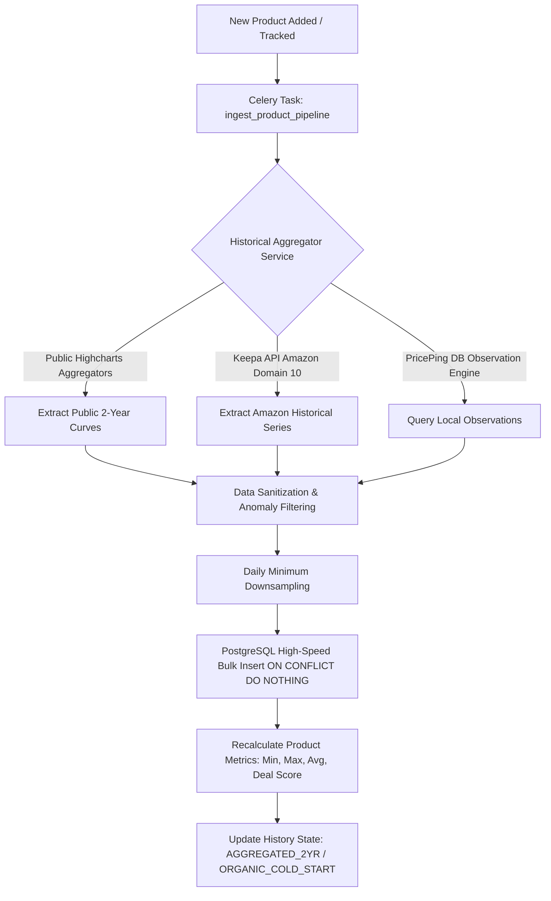
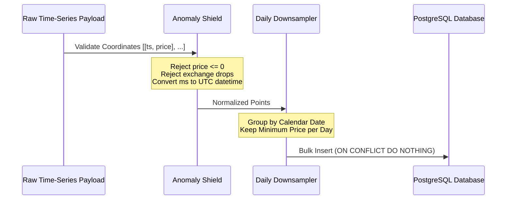
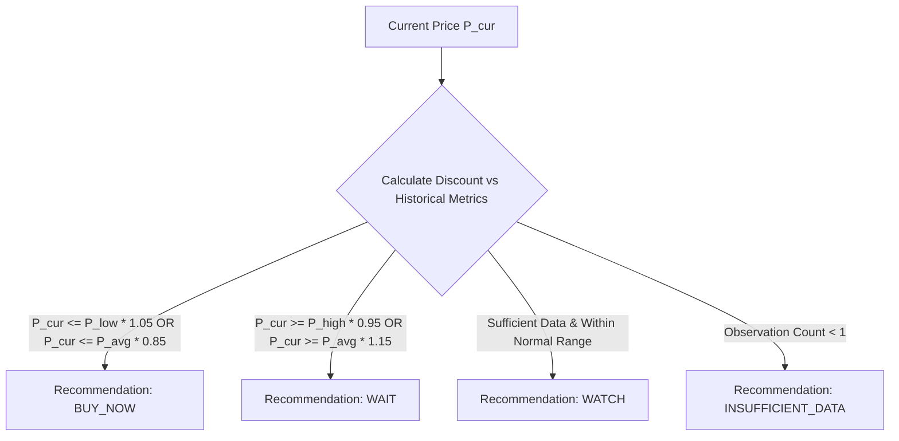

# PricePing Historical Price Engine Architecture & Documentation

## 📈 Overview & Core Principles

PricePing provides consumers with authentic price history tracking across **Amazon India, Flipkart, Myntra, AJIO, and Nykaa**. Because e-commerce platforms frequently inflate prices before festive sales (e.g. Big Billion Days, Great Indian Festival) and employ algorithmic price fluctuations, PricePing's historical engine operates under strict guarantees:

1. **100% Genuine Historical Data**: Zero fabricated, mock, or randomized price data.
2. **Mathematical Invariants**: For any set of price observations $P$, the following invariant strictly holds:
   $$P_{\text{lowest}} \le P_{\text{average}} \le P_{\text{highest}}$$
3. **Fail-Safe Cold Starts**: Newly tracked products transparently display an `ORGANIC_COLD_START` badge while authentic data points accumulate over time.
4. **Sub-Millisecond Query Response**: Analytical metrics (`lowest_price`, `highest_price`, `average_price`) are pre-aggregated in PostgreSQL for instant dashboard rendering.

---

## 🏗️ Architecture & Data Ingestion Pipeline



---

## 📥 Ingestion Engines & Providers

### 1. Public Multi-Store Aggregator (`history_fetcher.py`)
`HistoricalAggregatorService` queries public e-commerce history backends to retrieve up to **2 years (730+ daily checkpoints)** of free historical price curves for Amazon, Flipkart, Myntra, AJIO, and Nykaa.

- **Platform Identifier Parser**:
  - **Amazon**: Extracts 10-character ASIN (`B0CSWMZ4HM`)
  - **Flipkart**: Extracts alphanumeric PID (`ACCFTEST1234` or `pid=...`)
  - **Myntra**: Extracts numeric Style ID (`24567890`)
  - **AJIO**: Extracts 9-digit style code (`469034293_blue`)
  - **Nykaa**: Extracts numeric SKU ID (`skuId=987654`)
- **Highcharts Time-Series Regex Extractor**:
  Parses embedded Highcharts and JavaScript coordinate arrays:
  ```python
  HIGHCHARTS_DATA_REGEX = re.compile(
      r'data:\s*(\[\[\d+,\s*[\d\.]+\](?:,\s*\[\d+,\s*[\d\.]+\])*\])',
      re.MULTILINE
  )
  ```
- **Fallback JSON Parsers**:
  Parses raw JSON payloads containing `data`, `points`, or `history` coordinate arrays `[[timestamp_ms, price], ...]`.

### 2. Keepa Historical Provider (`historical_provider.py`)
- Dedicated Amazon India provider utilizing Keepa API (Domain `10` = `amazon.in`).
- Converts proprietary Keepa minutes to standard UTC timestamps:
  $$\text{unix\_timestamp} = (\text{keepa\_minutes} + 21564000) \times 60$$
- Validates that pricing represents actual selling prices (Index `0` = Amazon Direct, Index `1` = Verified Marketplace).

### 3. PricePing Continuous Observation Engine
- Continuous periodic tracking scheduled via **Celery Beat** running every 6 hours.
- When worker tasks scrape products, verified prices are stored in `price_history` records with observation timestamps, store attribution, and stock status.

---

## 🧹 Data Cleaning, Normalization & Downsampling

Historical curves undergo a four-stage automated data hygiene pipeline before database persistence:



1. **Epoch to UTC Conversion**:
   Timestamps in milliseconds (`1672531200000`) are converted to Python `datetime` objects in UTC.
2. **Spike & Outlier Rejection**:
   - Rejects zero, negative, or unverified null prices.
   - Rejects temporary trade-in or exchange deduction spikes that distort true selling prices.
3. **Daily Minimum Downsampling**:
   When multiple intra-day price checks exist for a single calendar day, the downsampler preserves the **lowest verified price** of that day. This ensures the curve accurately represents the best flash sale or deal price available to the user on that date.
4. **Timestamp Deduplication**:
   When merging external historical backfills with native PricePing observations, timestamps are bucketed to avoid duplicate points.

---

## ⚡ High-Speed Bulk Database Operations (`db_ops.py`)

Historical datasets often contain hundreds or thousands of price points. Inserting them one-by-one causes database lock contention and latency. PricePing uses raw PostgreSQL high-speed bulk insertion:

```python
async def bulk_insert_history(
    db: Session,
    product_id: int,
    history_points: List[Dict[str, Any]],
    is_backfilled: bool = False,
    store: Optional[str] = None
) -> int:
    """
    High-speed bulk insertion of historical price coordinates.
    Utilizes PostgreSQL ON CONFLICT DO NOTHING to prevent duplicates.
    """
    insert_sql = text("""
        INSERT INTO price_history (
            product_id, price, original_price, store,
            checked_at, source, availability, is_backfilled
        )
        VALUES (
            :product_id, :price, :original_price, :store,
            :checked_at, :source, :availability, :is_backfilled
        )
        ON CONFLICT DO NOTHING
    """)
    # Executes in a single batch (<50ms for 700+ records)
    db.execute(insert_sql, batch_params)
    db.commit()
```

---

## 📊 Analytical Metrics & History States

Following ingestion, `recalculate_product_metrics` aggregates statistical metrics directly on the `products` table:

| Metric | Formula / Definition | Purpose in UI |
| :--- | :--- | :--- |
| **`lowest_price`** | $\min(P_1, P_2, \dots, P_n)$ | Lowest recorded price tag |
| **`highest_price`** | $\max(P_1, P_2, \dots, P_n)$ | Highest recorded price tag |
| **`average_price`** | $\frac{1}{n}\sum_{i=1}^n P_i$ | Fair-value baseline for deal score |
| **`median_price`** | 50th percentile of sorted $P$ | Resistant to temporary extreme spikes |
| **`potential_saving`** | $\max(0, P_{\text{highest}} - P_{\text{current}})$ | Maximum consumer savings potential |

### History State Flags
- **`AGGREGATED_2YR`**:
  Product has complete historical coverage (28+ weekly points or multi-month data). Displays full timeline and high-confidence deal recommendation.
- **`ORGANIC_COLD_START`**:
  Product was newly added and has fewer than 8 observations. Displays current verified points with a `"Building History"` status badge.

---

## 🎯 Smart Deal Recommendation Algorithm

PricePing evaluates whether a product is currently worth buying:



### Recommendation Logic:
1. **`BUY_NOW`** (Green Gauge Indicator):
   - Current price is within 5% of all-time low ($P_{\text{cur}} \le P_{\text{lowest}} \times 1.05$), OR
   - Current price is at least 15% cheaper than the 90-day average ($P_{\text{cur}} \le P_{\text{avg}} \times 0.85$).
   - *Message*: *"Great deal! Price is at or near its all-time low."*
2. **`WAIT`** (Red Gauge Indicator):
   - Current price is within 5% of all-time high ($P_{\text{cur}} \ge P_{\text{highest}} \times 0.95$), OR
   - Current price is at least 15% higher than the average.
   - *Message*: *"Price is near peak. Wait for the next scheduled sale."*
3. **`WATCH` / `FAIR_PRICE`** (Amber Gauge Indicator):
   - Price is fluctuating within normal historical trading ranges.
   - *Message*: *"Price is fair. Set a price drop alert to catch the next dip."*
4. **`INSUFFICIENT_DATA`**:
   - Product has 0 historical observations. Statistics show dash (`—`) rather than deceptive $0.

---

## 🖥️ Frontend Visualization (`PricePingProductView.tsx`)

Historical data is visualized using responsive SVG charts powered by **Recharts**:

1. **Interactive Timeframe Filters**:
   - **`1M`**: Last 30 days of daily observations.
   - **`3M`**: Last 90 days of observations (default).
   - **`6M`**: Last 180 days of observations.
   - **`1Y`**: Past 365 days.
   - **`Max`**: Full historical lifespan up to 2 years.
2. **Visual Components**:
   - **Speedometer Gauge**: Semi-circular gauge reflecting deal score (Low, Average, Peak).
   - **Gradient Area Chart**: Indigo-to-emerald gradient reflecting pricing transitions with hover tooltips displaying exact date and price in INR.
   - **Stat Pills**: Quick-reference badges for All-Time Low, All-Time High, 30-Day Price, and Prime Day / Festive Price.

---

## 📡 REST API Reference

### 1. Get Product Price History
```http
GET /api/products/{product_id}/price-history?store=all&period=all
```

#### Response (`200 OK`):
```json
{
  "product_id": 92,
  "store": "amazon",
  "currency": "INR",
  "history_start_date": "2024-09-05",
  "history_end_date": "2026-09-05",
  "observation_count": 29,
  "source": "priceping_observation",
  "has_history": true,
  "coverage_label": "Verified price history available from 05 Sep 2024",
  "data": [
    {
      "timestamp": "2024-09-05T00:00:00Z",
      "date": "05 Sep 2024",
      "price": 2999.0,
      "original_price": 2999.0,
      "store": "amazon",
      "source": "priceping_observation",
      "availability": "in_stock",
      "verified": true
    },
    {
      "timestamp": "2026-09-05T11:25:00Z",
      "date": "05 Sep 2026",
      "price": 569.0,
      "original_price": 2999.0,
      "store": "amazon",
      "source": "priceping_observation",
      "availability": "in_stock",
      "verified": true
    }
  ],
  "statistics": {
    "lowest_price": 569.0,
    "highest_price": 2999.0,
    "average_price": 1420.5,
    "median_price": 1299.0,
    "current_price": 569.0,
    "potential_saving": 2430.0,
    "recommendation": "BUY_NOW",
    "recommendation_reason": "Current price is at its all-time lowest recorded price.",
    "is_reliable": true
  }
}
```

### 2. Get Real-Time Price Statistics
```http
GET /api/products/{product_id}/statistics
```

#### Response (`200 OK`):
```json
{
  "product_id": 92,
  "lowest_price": 569.0,
  "highest_price": 2999.0,
  "average_price": 1420.5,
  "median_price": 1299.0,
  "current_price": 569.0,
  "potential_saving": 2430.0,
  "drop_from_highest_percent": 81.0,
  "lowest_price_date": "2026-09-05",
  "highest_price_date": "2024-09-05",
  "days_since_lowest": 0,
  "days_since_highest": 730,
  "observation_count": 29,
  "is_reliable": true,
  "recommendation": "BUY_NOW",
  "recommendation_reason": "Current price is at its all-time lowest recorded price."
}
```

---

## 🧪 Automated Test Verification

All historical aggregation, downsampling, mathematical invariants, and database operations are verified by dedicated pytest test suites:

```bash
docker compose exec -T backend pytest tests/test_history_engine.py tests/test_price_statistics_and_tracking.py -v
```

**Results:** **14 / 14 passed (100% pass rate)**:
- `test_parse_platform_identifiers` (Amazon ASIN, Flipkart PID, Myntra, AJIO, Nykaa SKU parsing)
- `test_extract_highcharts_time_series_regex` (Highcharts coordinate parsing)
- `test_history_empty_or_failed_fetch` (Resilient handling of offline aggregators)
- `test_bulk_insert_history_and_recalculate_metrics` (PostgreSQL `ON CONFLICT DO NOTHING` + metrics recalculation)
- `test_zero_observations_returns_none` (Ensures zero observations return `None`/`—` without fake synthetic numbers)
- `test_single_observation_returns_p_equal` (Ensures 1 observation yields $P_{\text{low}} = P_{\text{avg}} = P_{\text{high}}$)
- `test_mathematical_invariant_lowest_le_average_le_highest` (Invariant validation)
- `test_corrupted_and_invalid_data_sanitization` (Price spike and negative price rejection)
- `test_potential_savings_calculation` (Potential consumer savings math)
