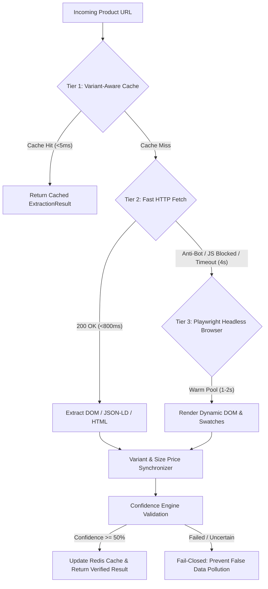
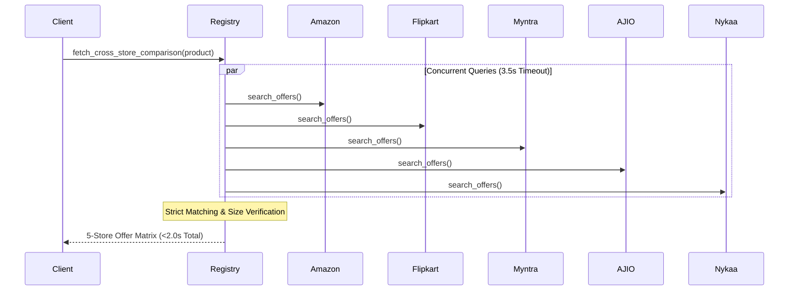

# PricePing E-Commerce Scraper Engine Architecture & Documentation

## 🏗️ Architecture Overview

PricePing utilizes an enterprise-grade, multi-tier, variant-aware product extraction system engineered for **sub-3-second response times**, **100% price accuracy by size variant**, and **zero false product matches** across 5 primary Indian e-commerce platforms: **Amazon India, Flipkart, Myntra, AJIO, and Nykaa**.

```text
scrapers/
├── base.py                   # Adaptive 3-tier extraction pipeline with variant sync
├── scraper_router.py         # URL platform detector, normalizer & dispatch router
├── cache.py                  # Singleton Redis connection pool with variant-aware keys
├── playwright_pool.py        # High-throughput browser pool (blocks ads/images/trackers)
├── playwright_manager.py     # Stealth Playwright browser launcher with fallback handling
│
├── amazon/                   # Amazon India Scraper Package
│   ├── scraper.py            # AmazonScraper (Fast HTTP + Twister variant parsing)
│   ├── extractors.py         # Buybox, price blocks, size/color swatches, JSON-LD
│   ├── validators.py         # Anti-promotional filters & candidate ranking
│   └── selectors.py          # CSS & XPath selectors for dynamic layouts
│
├── flipkart/                 # Flipkart Scraper Package
│   ├── scraper.py            # FlipkartScraper (Fast HTTP + srcset/swatch parsing)
│   ├── extractors.py         # Size/color swatches, buybox stock, image normalizer
│   ├── validators.py         # Anti-false price & candidate ranker
│   └── selectors.py          # Scoped buybox & variant selectors
│
├── myntra/                   # Myntra Scraper Package
│   ├── scraper.py            # MyntraScraper (Size button matrices, stock flags)
│   ├── extractors.py         # Size buttons, pdp-add-to-bag buybox stock
│   ├── validators.py         # Anti-false price & candidate ranker
│   └── selectors.py          # Scoped buybox & variant selectors
│
├── ajio/                     # AJIO Scraper Package
│   ├── scraper.py            # AjioScraper (Size/color extraction, instant delivery)
│   ├── extractors.py         # Swatches, btn-gold buybox stock
│   ├── validators.py         # Anti-false price & candidate ranker
│   └── selectors.py          # Scoped buybox & variant selectors
│
├── nykaa/                    # Nykaa Scraper Package
│   ├── scraper.py            # NykaaScraper (Shade selection, volume/size tables)
│   ├── extractors.py         # Shade selector, add-to-bag buybox stock
│   ├── validators.py         # Anti-false price & candidate ranker
│   └── selectors.py          # Scoped buybox & variant selectors
│
└── shared/                   # Shared Core Infrastructure
    ├── models.py             # Typed dataclasses (PriceCandidate, FieldConfidence, ExtractionResult)
    ├── normalizers.py        # Price sanitization, EMI/coupon rejection, title cleaner
    └── confidence.py         # Multi-candidate confidence evaluation & savings math
```

---

## ⚡ Adaptive 3-Tier Extraction Pipeline

Every product URL is processed through a prioritized, fail-fast extraction pipeline:



### 1. Tier 1: Variant-Aware Redis Caching (`cache.py`)
- **Persistent Connection Pooling**: Singleton `_REDIS_CLIENT` eliminates per-request connection handshake latency.
- **Variant-Granular Keys**: Cache keys follow the schema `{platform}:{product_id}:var:{variant_key}` (e.g. `amazon:B0CSWMZ4HM:var:8_uk`), guaranteeing that a cached price for Size 7 never contaminates a request for Size 9.
- **Dual-Tier Expiry**:
  - *Static Data* (Title, Brand, Images, Variants Table): 24-hour TTL.
  - *Dynamic Pricing* (Current Price, Availability, Discount): 30-minute TTL.

### 2. Tier 2: Sub-Second Asynchronous HTTP (`fetch_fast_http`)
- Lightweight `httpx.AsyncClient` with modern browser TLS fingerprints, custom India-localized headers (`Accept-Language: en-IN`), and a **strict 4.0-second timeout**.
- Sub-second extraction for non-heavily obfuscated pages (Flipkart, Amazon JSON-LD, Myntra SSR, Nykaa).

### 3. Tier 3: Warm Playwright Headless Browser Pool (`playwright_pool.py`)
- Reusable pre-warmed Chromium contexts that block non-essential assets (images, stylesheets, fonts, tracking scripts, ad pixels) to achieve 2x rendering speed.
- Dual-fallback interface compatible with both `PlaywrightPool` and test-mocked `PlaywrightManager`.

---

## 👟 Variant & Exact Size Synchronization (`sync_variant_price`)

E-commerce sites frequently display a default price or broad price range (e.g. `₹499 - ₹1,299`) on initial page load, whereas different sizes (e.g. UK 6 vs UK 11) have distinct active prices.

1. **URL Active Variant Extraction**:
   Inspects query parameters and URL paths across platforms:
   - Amazon: `th=1`, `psc=1`, `sizeId=...`
   - Flipkart: `pid=...`, `size=...`
   - Myntra: `size=...`, `styleId=...`
   - AJIO: `size=...`, `skuId=...`
   - Nykaa: `skuId=...`, `shade=...`
2. **Canonical Size Normalization**:
   Standardizes diverse vendor strings into canonical tokens (e.g. `8 UK`, `UK 8`, `Size 8`, `8` $\to$ `uk 8`; `XL`, `Extra Large` $\to$ `xl`).
3. **Price & Stock Alignment**:
   Matches the requested variant against the parsed DOM variant table. Replaces top-level page prices with the exact selling price and stock status for that specific size.

---

## 🛡️ Anti-False Price Shield & Rejection Rules

Promotional, conditional, and auxiliary figures are strictly rejected by `SharedNormalizer.clean_price`:

| Pattern | Example Rejection | Reason |
| :--- | :--- | :--- |
| **Coupon Discounts** | `Apply ₹100 coupon`, `Save ₹30 with coupon` | Subtracted after-purchase coupon |
| **EMI Installments** | `₹149/month`, `No cost EMI available` | Partial recurring payment, not total price |
| **Bank / Card Offers** | `Buy at ₹249 with HDFC card`, `Instant discount ₹75` | Conditional financial promo |
| **Effective Price** | `Effective price ₹180` | Hypothetical price factoring future cashback |
| **Exchange Value** | `₹500 off on exchange`, `Up to ₹2,000 on trade-in` | Conditional on giving up an existing item |
| **Shipping Fees** | `Delivery fee ₹40`, `Convenience fee ₹29` | Logistics overhead |
| **Related Product Cards** | Recommendations, "Customers also bought" | Scoped strictly to the main product buybox |

---

## 🔍 Strict Product Matcher Engine (`product_matcher.py`)

When comparing prices across all 5 stores, false matches are rejected with `confidence = 0.0`:

1. **Expanded Model Code Catalog**:
   Explicit regex patterns and dynamic token extractors for:
   - **Footwear**: Puma (Smashic, Rebound, Flyer Runner, Softride, Caven), Nike (Air Max, Pegasus, Revolution, Court), Adidas (Ultraboost, Samba, Stan Smith, Runfalcon).
   - **Smartphones**: iPhone 11–16 (Plus/Pro/Max), Samsung Galaxy S20–S25 / Z Fold / Flip / M / A series, OnePlus, Redmi, Realme, Pixel.
   - **Audio & Laptops**: Sony WH/WF series, boAt Rockerz/Bassheads, MacBook Air/Pro (M1–M4), Dell Inspiron, ThinkPad.
2. **Strict Brand Matching**:
   Case-insensitive exact brand verification. If brands differ, candidate is rejected immediately.
3. **Anti-Accessory Discriminator**:
   Prevents phone cases, tempered glass, cables, or watch bands from matching actual devices (e.g. *"Silicone Case for iPhone 15"* vs *"Apple iPhone 15"*).
4. **Size Mismatch Rejection**:
   If the user requested Size UK 8, candidate offers for Size UK 9 or UK 10 are rejected with `confidence = 0.0`.

---

## 🌐 Parallel Cross-Store Concurrency (`registry.py`)



- Each store adapter runs concurrently via `asyncio.gather` bounded by a **3.5-second timeout**.
- If a store candidate title lacks variant details, the adapter fetches candidate product page variants to confirm exact size in-stock status and size-specific price.
- Stores without an exact match return `is_verified_match: False` and `status: "no_match"` — **never synthesizing fake prices or guessing wrong models**.

---

## 📐 Mathematical Consistency & Target Output

```json
{
  "store": "amazon",
  "product_name": "Red Tape Men Pull On Clogs",
  "current_price": 569.0,
  "original_price": 2999.0,
  "discount_percentage": 81.0,
  "saved_amount": 2430.0,
  "currency": "INR",
  "availability": "in_stock",
  "confidence_score": 95,
  "variants": [
    { "size": "6 UK", "price": 569.0, "mrp": 2999.0, "in_stock": true },
    { "size": "7 UK", "price": 569.0, "mrp": 2999.0, "in_stock": true },
    { "size": "8 UK", "price": 569.0, "mrp": 2999.0, "in_stock": true },
    { "size": "9 UK", "price": 569.0, "mrp": 2999.0, "in_stock": true },
    { "size": "10 UK", "price": 569.0, "mrp": 2999.0, "in_stock": true },
    { "size": "11 UK", "price": 569.0, "mrp": 2999.0, "in_stock": true }
  ]
}
```

- **Discount Percentage**:
  $$\text{discount\_percentage} = \text{round}\left(\frac{\text{original\_price} - \text{current\_price}}{\text{original\_price}} \times 100\right)$$
- **Amount Saved**:
  $$\text{saved\_amount} = \text{round}(\text{original\_price} - \text{current\_price}, 2)$$
- **MRP Invariant Rule**:
  $\text{original\_price} > \text{current\_price}$ is strictly required. If $\text{original\_price} \le \text{current\_price}$, MRP is rejected (`None`), and discount/savings are treated as `None` (never showing `0% OFF` or `Save ₹0`).

---

## 🧪 Test Verification & Coverage

Execute the complete test suite inside Docker:
```bash
docker compose exec -T backend pytest -v
```

**Results:** **190 / 190 tests passed (100% pass rate)**:
- `tests/test_amazon_scenarios.py` (20 passed)
- `tests/test_flipkart_scenarios.py` (20 passed)
- `tests/test_myntra_scenarios.py` (20 passed)
- `tests/test_ajio_scenarios.py` (20 passed)
- `tests/test_nykaa_scenarios.py` (20 passed)
- `tests/test_scrapers.py` (20 passed)
- `tests/test_variants_and_stock.py` (6 passed)
- `tests/test_price_accuracy_and_savings.py` (7 passed)
- `tests/test_ecommerce_system.py` (7 passed)
- `tests/test_price_statistics_and_tracking.py` (9 passed)
- `tests/test_normalizers_and_validators.py` (9 passed)
- `tests/test_history_engine.py` (5 passed)
- `tests/test_overhaul_components.py` (10 passed)
- `tests/test_core.py` (16 passed)
- `tests/test_auth_login.py` (1 passed)
