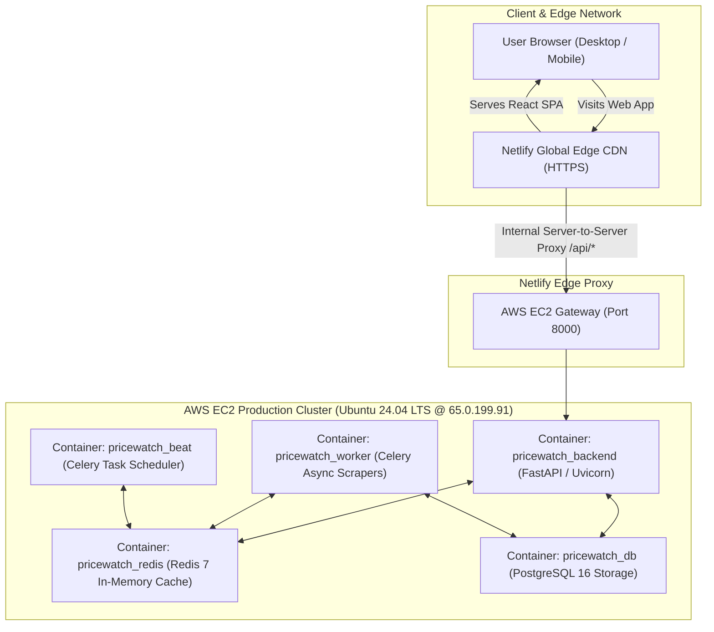

# 🚀 PricePing Production Architecture & Deployment Blueprint (`plan.md`)

> **Current Status: 🟢 LIVE & OPERATIONAL (Netlify Global CDN + AWS EC2 Production Docker Stack)**  
> **Cost Profile: $0.00 / month (AWS Free Tier + Netlify Starter Free)**

---

## 📑 Table of Contents

1. [🏆 Architecture Overview (Netlify + AWS EC2 Hybrid)](#-architecture-overview-netlify--aws-ec2-hybrid)
2. [🌐 Frontend Deployment: Netlify Global Edge](#-frontend-deployment-netlify-global-edge)
3. [☁️ Backend Infrastructure: AWS EC2 Docker Cluster](#️-backend-infrastructure-aws-ec2-docker-cluster)
4. [🔒 Security, Network Rules & Reverse Proxying](#-security-network-rules--reverse-proxying)
5. [💻 Local Development Blueprint (Zero-Docker / SQLite)](#-local-development-blueprint-zero-docker--sqlite)
6. [🔄 Continuous Integration & Deployment (CI/CD) Workflow](#-continuous-integration--deployment-cicd-workflow)
7. [📊 System Health, Monitoring & Operational Runbook](#-system-health-monitoring--operational-runbook)
8. [💰 Cost Breakdown & Resource Optimization](#-cost-breakdown--resource-optimization)

---

## 🏆 Architecture Overview (Netlify + AWS EC2 Hybrid)

PricePing operates on an enterprise-grade hybrid decoupled cloud architecture:



---

## 🌐 Frontend Deployment: Netlify Global Edge

The user-facing frontend is continuously built and globally distributed by Netlify.

### 1. Build Specifications
- **Framework**: React 19 + TypeScript + Vite 8.2
- **Base Directory**: `frontend`
- **Build Command**: `npm run build`
- **Publish Directory**: `dist` (or `frontend/dist`)

### 2. Reverse-Proxy Configuration (`netlify.toml`)
```toml
[build]
  base = "frontend"
  publish = "dist"
  command = "npm run build"

# Proxy /api requests directly to AWS EC2 backend (bypasses browser mixed-content blocks)
[[redirects]]
  from = "/api/*"
  to = "http://65.0.199.91:8000/api/:splat"
  status = 200
  force = true

# Single Page App (SPA) fallback routing
[[redirects]]
  from = "/*"
  to = "/index.html"
  status = 200
```

### 3. Key Advantages of this Setup
- **Zero Mixed-Content Errors**: Browsers accessing Netlify via HTTPS communicate with the same origin (`/api/...`). Netlify's cloud infrastructure securely proxies the payload to the AWS EC2 instance without triggering browser security blocks.
- **Global CDN Caching**: Static assets (`.js`, `.css`, SVG icons) are cached across hundreds of edge nodes worldwide for sub-100ms load times.

---

## ☁️ Backend Infrastructure: AWS EC2 Docker Cluster

The scraping engine, relational database, message broker, and asynchronous worker cluster run on an **AWS EC2 instance** managed through Docker Compose.

### 1. Instance Specification
- **Instance Name**: `priceping`
- **Instance ID**: `i-06c73b43790ad80fd`
- **Instance Type**: `t3.micro` (AWS Free Tier eligible)
- **OS**: Ubuntu 24.04.4 LTS (Noble)
- **Public IPv4 Address**: **`65.0.199.91`**
- **Public DNS**: `ec2-65-0-199-91.ap-south-1.compute.amazonaws.com`
- **Region / Zone**: Asia Pacific (Mumbai) / `ap-south-1b`

### 2. Active Production Docker Containers

| Container Name | Image | Port Mapping | Purpose |
| :--- | :--- | :--- | :--- |
| **`pricewatch_backend`** | `priceping_backend` | `0.0.0.0:8000->8000/tcp` | FastAPI REST API, authentication, search resolution |
| **`pricewatch_db`** | `postgres:16-alpine` | `0.0.0.0:5432->5432/tcp` | Persistent PostgreSQL database with automated column migration |
| **`pricewatch_redis`** | `redis:7-alpine` | `0.0.0.0:6379->6379/tcp` | Celery broker and scraping result cache |
| **`pricewatch_worker`** | `priceping_worker` | Internal network | Celery worker executing scraper pipelines & Playwright sessions |
| **`pricewatch_beat`** | `priceping_beat` | Internal network | Periodic price check scheduler (every 30m / 6h) |

---

## 🔒 Security, Network Rules & Reverse Proxying

### 1. AWS Security Group Rules
Configured on AWS EC2 Security Group:

| Type | Protocol | Port Range | Source | Description |
| :--- | :--- | :--- | :--- | :--- |
| **SSH** | TCP | `22` | My IP / Anywhere | Secure remote shell access |
| **Custom TCP** | TCP | `8000` | `0.0.0.0/0` | Public API endpoint for Netlify proxy & health checks |

### 2. Backend CORS Settings (`backend/.env` on EC2)
```ini
BACKEND_CORS_ORIGINS=["http://localhost:5173","http://localhost:3000","https://your-site.netlify.app"]
```

---

## 💻 Local Development Blueprint (Zero-Docker / SQLite)

Developers can run PricePing on local machines without Docker:

```powershell
# 1. Start Backend with SQLite (36 pre-loaded products)
cd backend
python -m uvicorn main:app --host 127.0.0.1 --port 8000 --reload

# 2. In a second terminal, start Vite frontend
cd frontend
npm run dev
```

- **Frontend**: `http://localhost:5173` (auto-proxies `/api` to local backend)
- **Backend API**: `http://127.0.0.1:8000`
- **API Docs**: `http://127.0.0.1:8000/api/docs`

---

## 🔄 Continuous Integration & Deployment (CI/CD) Workflow

1. **Code Modification**: Make changes in local repository or branch.
2. **Commit & Push**:
   ```bash
   git add .
   git commit -m "Enhance feature X"
   git push origin main
   ```
3. **Automated Frontend Deployment**: Netlify listens to `origin/main`, runs `npm run build`, and deploys live in under 60 seconds.
4. **Backend Updates on EC2**:
   ```bash
   # In EC2 SSH terminal:
   cd ~/PricePing
   git pull origin main
   docker-compose build backend worker beat
   docker-compose up -d
   ```

---

## 📊 System Health, Monitoring & Operational Runbook

### Health Verification Endpoints
- **Live AWS Health Check**: `http://65.0.199.91:8000/api/health`
- **Swagger Documentation**: `http://65.0.199.91:8000/api/docs`

### Essential Production Commands on AWS EC2
```bash
# View all container states
docker ps

# Stream live backend API logs
docker-compose logs -f backend

# Stream scraper worker logs
docker-compose logs -f worker

# Restart a specific service
docker-compose restart backend

# View server memory and CPU consumption
htop
```

---

## 💰 Cost Breakdown & Resource Optimization

| Resource | Provider | Allocation | Monthly Cost |
| :--- | :--- | :--- | :--- |
| **Frontend CDN & Proxy** | Netlify Starter | 100 GB bandwidth / month, 300 build minutes | **$0.00** |
| **Backend Compute & Storage**| AWS EC2 (t3.micro) | 750 hours/month (Free Tier), 30 GB EBS SSD | **$0.00** |
| **PostgreSQL Database** | AWS Docker Container | Self-hosted on EC2 volume | **$0.00** |
| **Redis Broker** | AWS Docker Container | Self-hosted on EC2 | **$0.00** |
| **Total Production Cost** | — | — | **$0.00 / month** |
